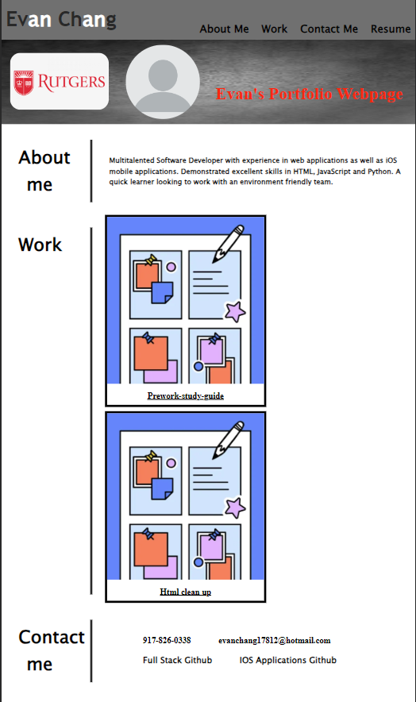

# Evan's Profile Page

## Description

Instead of going with a flashy profile page with a major flashy function, I've decided to go with a simple and direct profile page. I believe that showing all the different CSS skills and styles on my profile page with an easy to observe layout will highlight my skills as a front end developer more directly. This allows for me to show off all that I know to anyone interested to get in touch with me.

## Link
https://evan17812.github.io/Challenge1/

## Screenshot
